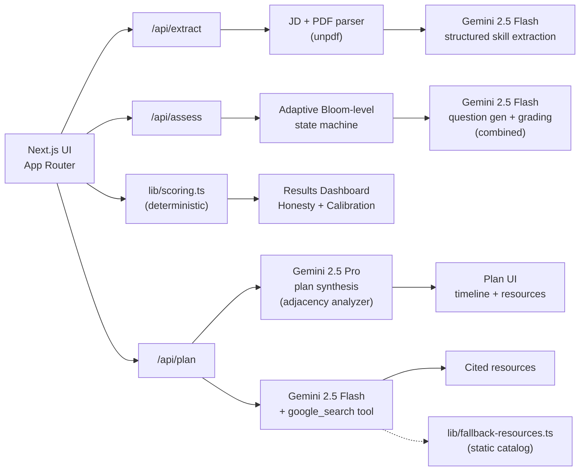

<div align="center">

# SkillForge

### Verified skills. Realistic plans.

**An AI agent that exposes the gap between what a resume claims and what a candidate actually knows — then builds an adjacency-aware learning plan with live, web-grounded resources.**

[Live Demo](#) · [Demo Video](#) · [Architecture](#architecture) · [Scoring Logic](#scoring-and-logic)

*Built for the Catalyst Hackathon by Deccan AI · Apr 26-27, 2026.*

</div>

---

## Why this exists

The Catalyst brief states the problem in one sentence:

> *"A resume tells you what someone claims to know — not how well they actually know it."*

Most reference implementations of this problem stop at keyword matching, single-prompt scoring, or static MCQ generators. **SkillForge takes the brief literally** and builds the entire experience around the gap between **claim** and **demonstrated competence**.

## What makes SkillForge different

| Most reference impls | SkillForge |
| --- | --- |
| One-shot LLM "match score" | **Adaptive multi-turn interview** mapped to Bloom's Taxonomy (drill down on weakness, level up on mastery) |
| Static MCQs / true-false | **Free-text answers** graded with a separate harsh-but-fair grader prompt |
| Score 0-100 dashboard | **Honesty Score** — visualizing the *delta* between claimed and verified, the literal answer to the prompt |
| Generic course list | **Adjacency-aware** plan: every recommendation is scored on `transferability × jd_relevance × realism` and explained |
| LLM-knowledge resource lists | **Live Google-grounded** resources via Gemini's `google_search` tool with citations |
| Streamlit prototype | **Polished Next.js + Tailwind** UI with motion, charts, dark theme |

## Quick demo flow

1. Paste a Job Description and upload (or paste) a resume.
2. SkillForge extracts 8-14 most assessment-worthy skills, weighted by JD importance.
3. For each skill, you self-rate 1-5 then take a short adaptive interview (free-text, ~3-4 turns).
4. The dashboard shows your **Honesty Score**, claimed-vs-verified bars, calibration radar, and gap severity.
5. The plan view orders gaps by leverage (adjacency × JD-weight), with curated resources and time estimates.

## Architecture



### Component map

| Layer | File | Responsibility |
| --- | --- | --- |
| Pages | `src/app/page.tsx` | Landing — JD + resume input |
| | `src/app/assess/page.tsx` | Adaptive conversational interview |
| | `src/app/results/page.tsx` | Honesty + calibration dashboard |
| | `src/app/plan/page.tsx` | Adjacency-aware learning plan |
| API | `src/app/api/extract/route.ts` | JD/resume → structured skills (Flash) |
| | `src/app/api/assess/route.ts` | One adaptive turn (Flash, JSON) |
| | `src/app/api/plan/route.ts` | Plan synthesis (Pro) + grounded resources (Flash) |
| Domain | `src/lib/scoring.ts` | Bloom mapping, calibration math, gap severity |
| | `src/lib/types.ts` | Shared TypeScript domain model |
| | `src/lib/gemini.ts` | Single Gemini SDK wrapper with model routing |
| Prompts | `src/lib/prompts/extract.ts` | Skill extraction system + schema |
| | `src/lib/prompts/assess.ts` | Adaptive interviewer + grader |
| | `src/lib/prompts/plan.ts` | Adjacency planner + resource curator |
| Fallback | `src/lib/fallback-resources.ts` | Evergreen static catalog |
| State | `src/lib/session.ts` | Client-side session in localStorage |

### Why these stack choices

- **Next.js App Router + TypeScript**: single repo, single deploy, full-stack with one mental model.
- **Gemini 2.5 (Flash + Pro)**: free API tier with `google_search` grounding (500 RPD free). Flash handles per-turn assessment; Pro handles the two heavy reasoning steps (plan synthesis with adjacency analysis).
- **`unpdf`**: serverless-friendly, no native binaries, zero hassle on Vercel.
- **Tailwind v4 + custom shadcn-style primitives**: shipped a polished UI without depending on a CLI.
- **`recharts` + `framer-motion`**: dashboard with a calibration radar and tasteful motion.
- **No database**: hackathon scope; sessions live in `localStorage`. Every important blob is JSON-serializable so persisting later is a 1-day add.

## Scoring and logic

### Bloom-mapped proficiency (0-100)

| Range | Bloom Level | What it means |
| --- | --- | --- |
| 0-20 | Remember | Recognizes/recalls terms; cannot define unprompted |
| 21-40 | Understand | Can explain the concept in own words |
| 41-60 | Apply | Can use it in a familiar scenario |
| 61-75 | Analyze | Debugs, decomposes, compares alternatives |
| 76-90 | Evaluate | Justifies trade-offs and critiques designs |
| 91-100 | Create | Designs non-trivial systems from scratch |

### Adaptive turn flow per skill (max ~4 turns)

1. **Self-rate (1-5)** — establishes the *claim*.
2. **Conceptual probe** (target Understand) — checks vocabulary maps to meaning.
3. **Applied scenario** (target Apply / Analyze) — checks they can use it.
4. **Trade-off probe** (target Evaluate) — *only if* prior was strong; otherwise drill back into Understand.

Each turn the model emits **graded result for the previous answer** (Bloom level demonstrated, score 0-100, evidence quote) AND the **next question** (with a target Bloom level) — or marks the interview final. Stop conditions: 3+ turns with consistent level, max 4 turns, or clearly maxed/floored.

Per-skill final score blends `0.7 × max(last 2 graded scores) + 0.3 × mean(all)` to favor recent demonstrated peaks while penalizing inconsistency.

### Calibration — the headline number

For each skill: `calibration_error = self_rating_pct - verified_pct` *(positive = overclaimed)*.

**Honesty Score** = `100 - mean(positive_only_overclaim) + small_underclaim_bonus`.

The headline copy on the dashboard names the top 1-2 most-overclaimed skills explicitly. This is the literal answer to the brief's "claims vs reality."

### Gap severity

| Severity | Condition |
| --- | --- |
| **Critical** | JD-required AND verified < 40 AND JD weight ≥ 2 |
| **Major** | JD-required AND verified 40-60 |
| **Minor** | JD-required AND verified 60-75 |
| **Strength** | verified > 75 |

### Adjacency score (0-1)

`adjacency = transferability(strengths, target) × jd_relevance(target) × realism(time_budget)`

Computed by Gemini 2.5 Pro in a single batched call across all gaps (one Pro call total, conserving the 100-RPD free quota). The model returns rationale per skill explicitly naming the transferable skills.

### Time-to-proficiency

`hours = base_from_resources × (1 - adjacency × 0.5)`, clamped to 5-200 hours per skill. Closer skills get reduced time budgets.

### Resource curation

For each plan item, one Flash call with `google_search` enabled returns 3 resources mixing **course / hands-on tutorial-or-project / reference-or-book**. URL validation strips dead links; fallback to the static catalog in `src/lib/fallback-resources.ts` if grounding fails or returns empty. Citations from `groundingMetadata` are surfaced as "Web-cited" badges in the UI.

## Setup

### Requirements

- Node.js 20+
- A free Gemini API key from [aistudio.google.com/apikey](https://aistudio.google.com/apikey) (no credit card required)

### Local run

```bash
git clone https://github.com/strhwke/skillforge.git
cd skillforge
npm install
cp .env.example .env.local
# Edit .env.local and paste your GEMINI_API_KEY
npm run dev
# Open http://localhost:3000
```

### Environment variables

```
GEMINI_API_KEY=...     # required
GEMINI_PROJECT_ID=...  # optional, only used as metadata
```

### Deploy to Vercel

This repo is Vercel-zero-config. Push the repo, click "Import Project" on Vercel, paste `GEMINI_API_KEY` as an env var, deploy. No build settings to change.

## Sample inputs and outputs

The `samples/` directory contains:

- `samples/jd-fintech.txt` — Senior Full-Stack JD at a fintech (the demo case).
- `samples/jd-ml.txt` — ML Engineer JD at a healthcare AI company.
- `samples/resume-fullstack.txt` — A 6-year full-stack resume for the fintech case.
- `samples/expected-output.json` — Illustrative output (orders of magnitude; specifics vary run-to-run).

The landing page has a **"Load sample"** button that pre-fills the fintech case for quick demos.

### What you should see for the demo case

- 12 skills extracted, with PostgreSQL, React, Node.js, System Design, GraphQL, AWS at the top.
- Strong verified scores on React, Node.js, TypeScript, PostgreSQL.
- **Major calibration gap on System Design** (claimed senior, verified Understand-level on trade-offs).
- **Critical gap on GraphQL** (not on resume, JD-required).
- A learning plan that puts GraphQL first (high adjacency from Node + REST), AWS second (medium adjacency), and System Design third (lower adjacency, longest time investment).

## Rate-limit budget

A single full demo session uses approximately:

- **Flash**: 12 calls (1 extract + 8 skills × ~1.3 turns avg) — well under 250 RPD free
- **Pro**: 1 call (plan synthesis) — well under 100 RPD free
- **Grounded Flash**: 5-7 calls (one per planned skill) — well under 500 RPD free

Comfortable headroom for many demo runs without hitting limits.

## Limitations and honest caveats

- **No code-eval sandbox.** Verification is conversational only, not "run my code." This is a deliberate scope choice for a 1-day build.
- **English-language JDs and resumes only.** Gemini handles other languages but we haven't tested.
- **No identity / persistence.** Sessions live in `localStorage`; close the tab and your assessment is gone.
- **Resource grounding can occasionally produce stale links.** We validate URL shape and fall back to a curated static catalog if so, but it's not 100% bulletproof.

## Project files of note

- `spec.md` — authoritative problem statement and scoring spec (human-edited only).
- `steps.md` — numbered implementation actions.
- `memory.md` — running log of decisions made during the build.
- `samples/` — JD/resume samples + expected output.

## License

MIT — see `LICENSE`.

## Acknowledgments

- Built for the [Deccan AI Catalyst Hackathon](https://www.deccan.ai/).
- Powered by [Google Gemini](https://ai.google.dev/) on its free tier.
- Resource grounding via Gemini's `google_search` tool.

---

<div align="center">
<sub>Built by Archisman Hes (<a href="https://github.com/strhwke">@strhwke</a>) for Catalyst.</sub>
</div>
