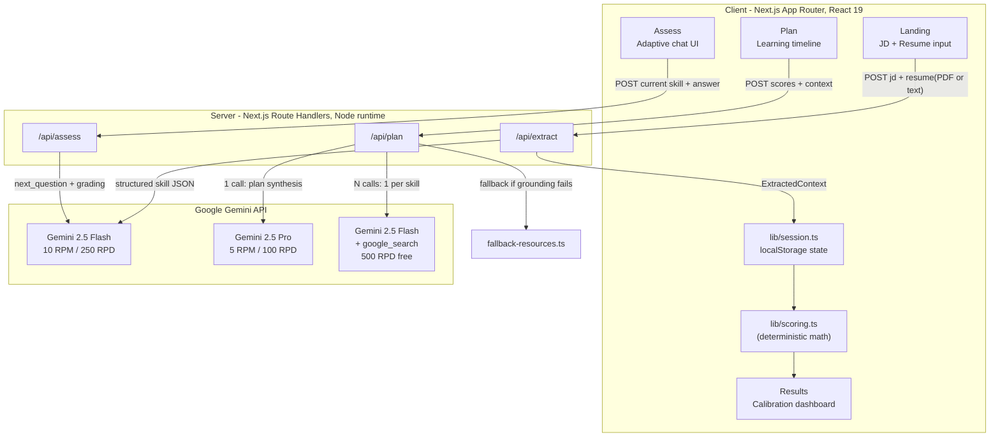
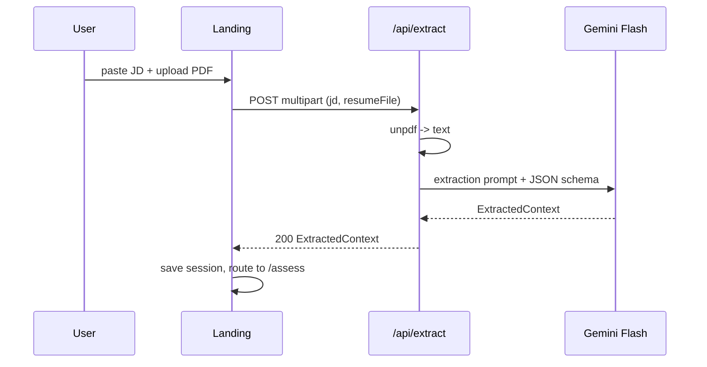
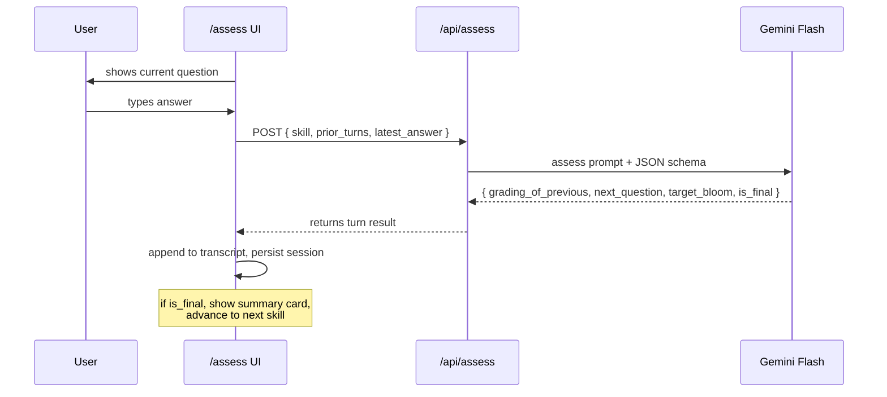
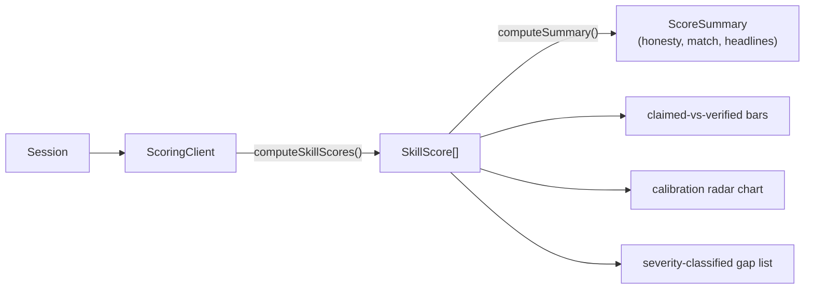
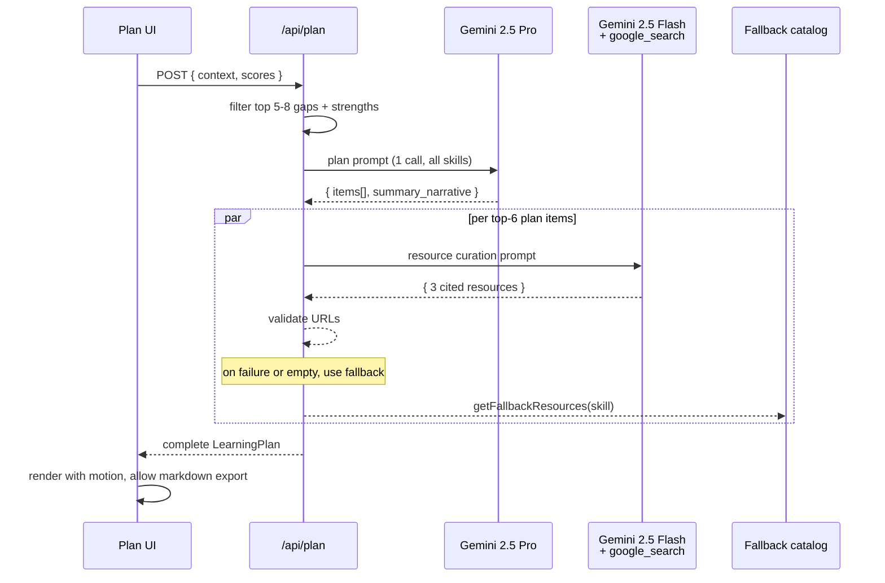

# SkillForge — Architecture

## High-level system diagram

## Request flow per phase

### 1. Extraction

### 2. Adaptive assessment (per turn)

### 3. Results (deterministic, no LLM)

### 4. Plan + grounded resources

## Data contracts

See `src/lib/types.ts` for the canonical schema. Highlights:

- `ExtractedContext` — JD title, summary, resume summary, candidate strengths, and the skills array with JD weight (0-3) and resume mention boolean.
- `AssessmentTurn` — one Q+A+grading record.
- `SkillScore` — final per-skill score with calibration error, severity, evidence quotes.
- `ScoreSummary` — Honesty Score, overall match, top strengths, critical gaps, headline note.
- `LearningPlanItem` — one targeted skill with adjacency, rationale, hours, week window, and resources.
- `LearningPlan` — total hours, weeks, items array, summary narrative.

## Scoring math (in plain prose)

1. Each turn produces a graded result `{bloom, score 0-100, evidence}` from a separate grading instruction in the same prompt as the next-question generator.
2. Per-skill final = `0.7 × max(last 2 graded scores) + 0.3 × mean(all graded scores)`.
3. Per-skill bloom = highest level demonstrated in the last 2 turns.
4. Calibration error = `self_rating_pct - verified_pct` (positive means overclaim).
5. **Honesty Score** = `100 - mean(positive_only_calibration_error) + (1.5 × count_of_underclaimers)`. Capped 0-100.
6. **Overall match** = JD-weight-weighted average of verified scores (`weight = jd_weight, or 0.5 for adjacent skills`).
7. **Severity** classification: critical (req + <40 + weight≥2), major (req + 40-60), minor (req + 60-75), strength (>75).
8. **Adjacency** is decided by Gemini 2.5 Pro from a single batched prompt across all gaps, weighted by `transferability × jd_relevance × realism`.
9. **Hours estimate** = `base × (1 - adjacency × 0.5)`, clamped 5-200.

## Rate-limit design

Per typical session:

- Extraction: 1 Flash call
- Assessment: ~8 skills × ~1.3 turns avg = ~10-12 Flash calls
- Plan synthesis: 1 Pro call
- Resource curation: 5-7 grounded Flash calls

Total per session: ~18-22 Flash + 1 Pro + ~6 grounded — comfortably within Gemini free-tier daily limits (Flash 250 RPD, Pro 100 RPD, Grounding 500 RPD).
